# PROYECTO DE TARJETA DE CRÉDITO PARA LA PASTELERÍA "CALEY"

Este proyecto consiste en **validar un numero de tarjeta de crédito** para poder realizar la compra de productos en la pastelería "Caley". Además se deberá **visualizar solo los últimos 4 dígitos** de la tarjeta en la pantalla para proteger los datos del cliente.

## IMAGEN FINAL DE MI PROYECTO

### Página de inicio

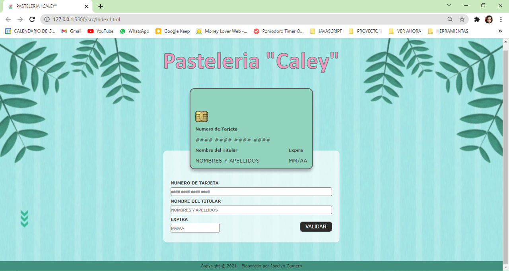

> Esta es la pagina que aparecera al cargar la aplicación web.

### Mensajes de "alert"

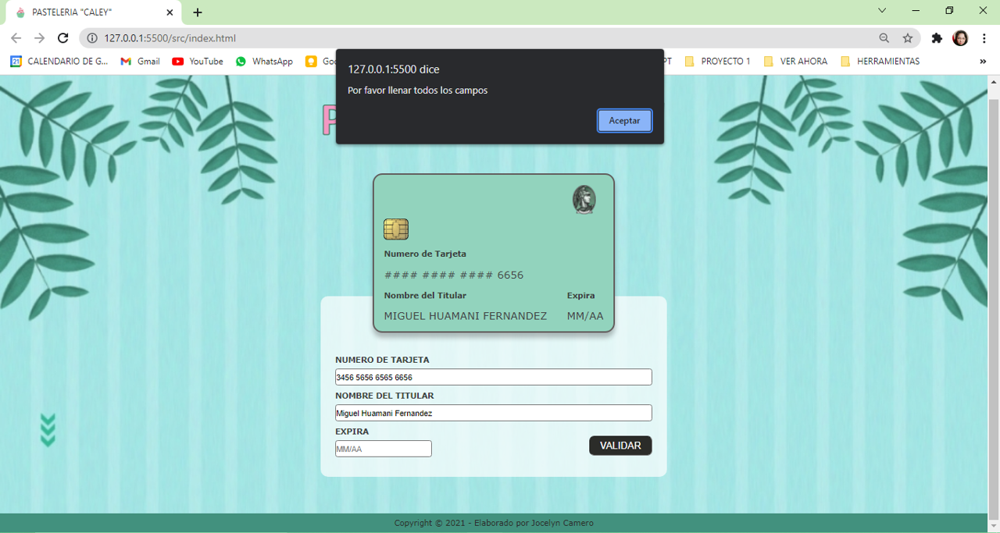

> Este mensaje de alerta sale cuando no se han llenado todos los campos del formulario.

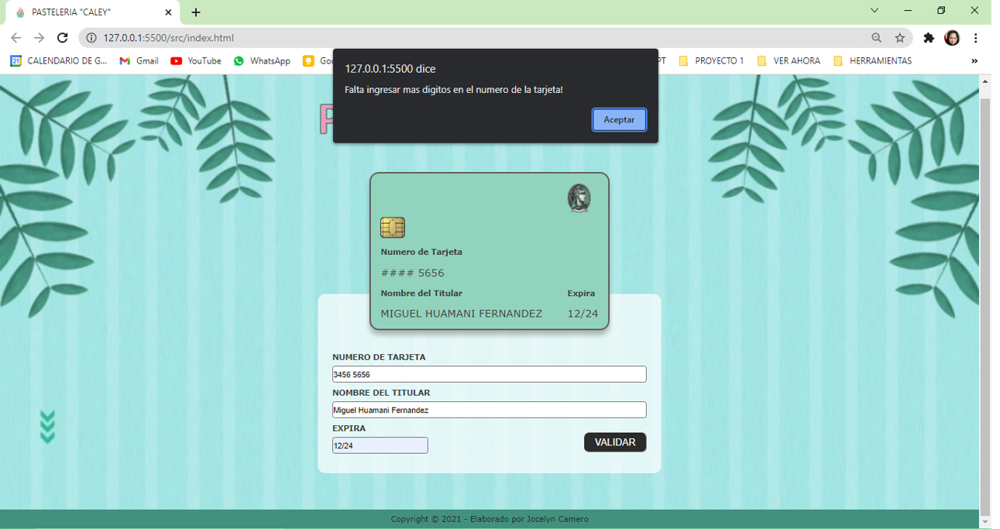

> Este mensaje de alerta sale cuando no se han llenado todos los digitos de la tarjeta de credito.

### Logos de red de tarjeta de credito

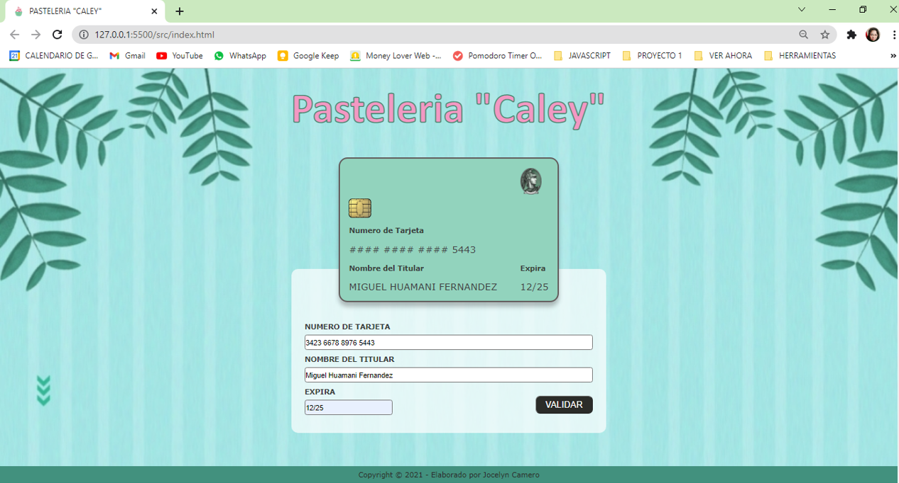

> Si el numero de la tarjeta de credito empieza con 3 saldra el logo de American Express en la tarjeta.

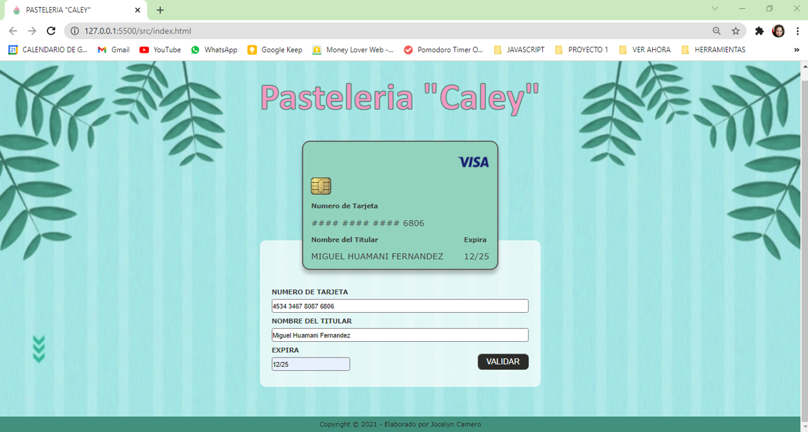

> Si el numero de la tarjeta de credito empieza con 4 saldra el logo de Visa en la tarjeta.

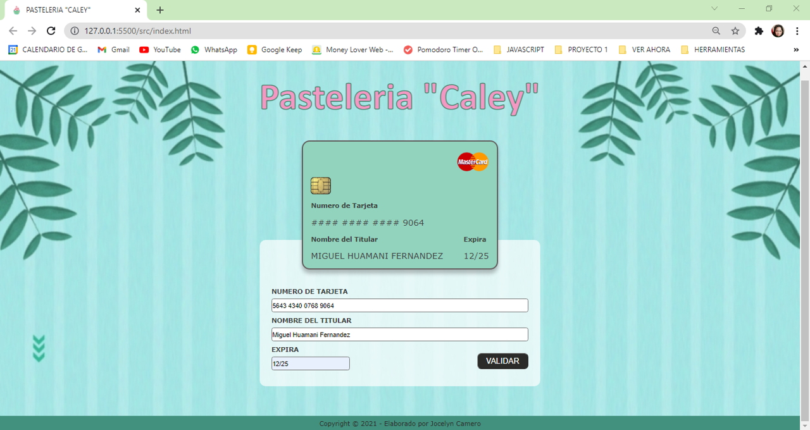

> Si el numero de la tarjeta de credito empieza con 5 saldra el logo de Master Card en la tarjeta.

### Respuesta al validar tarjeta

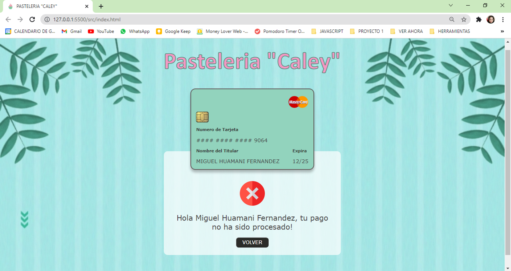

> Esta sera la respuesta si el numero de la tarjeta de credito es invalida.

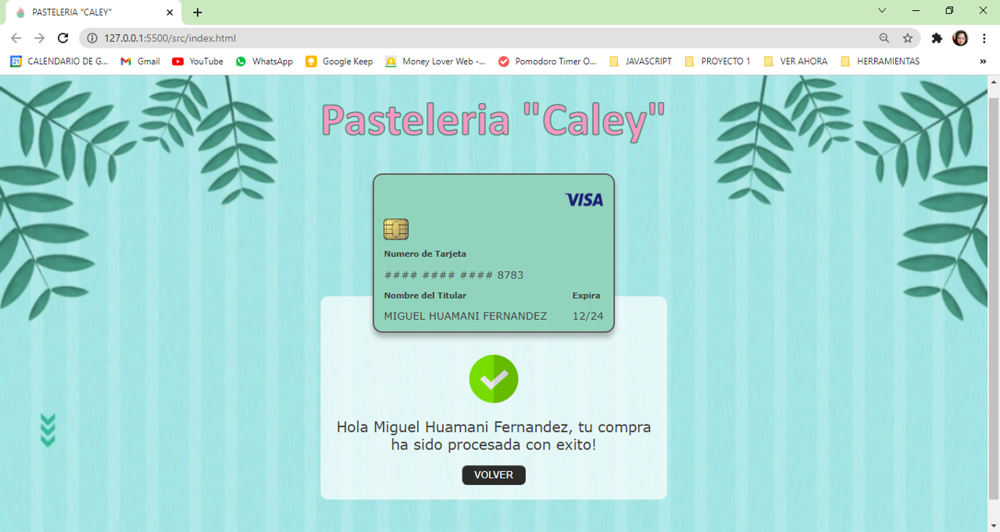

> Esta sera la respuesta si el numero de la tarjeta de credito es valida.

## INVESTIGACIÓN UX

**1.** Los usuarios son los clientes de la pastelería "Caley" que desean comprar sus productos a través de una aplicativo web para no tener que ir a la tienda física. Estos clientes quieren poder realizar su pago con una tarjeta de crédito para lo cual necesitan saber si su número de tarjeta ingresada es valida o no para la compra. Además el cliente desea que solo se visualice los últimos 4 dígitos del número de su tarjeta.

**2.** En el aplicativo el cliente podrá ingresar:

- Los números de su tarjeta, en el cual se permitirá solo dígitos del 0 al 9.
- Sus nombres y apellidos, el cual deberán ser solo letras.
- Y el mes y año de expiración de su tarjeta, el cual consta de 4 dígitos separados el mes y el año por un "/".

Estos datos se visualizaran en la pantalla simulando la imagen de una tarjeta de crédito a excepción de los números de la tarjeta el cual solo se visualizará los últimos 4 dígitos. Además se podrá visualizar el logo de **Visa**, **MasterCard** o **American Express** según corresponda. También tendrá un botón a disposición para poder validar su compra y su tarjeta de crédito.

**3.** **Prototipo en papel**
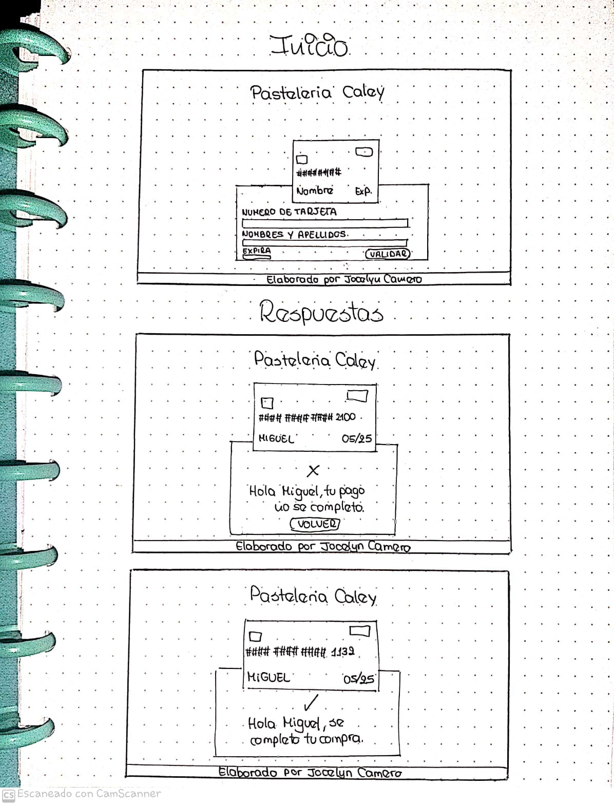

> Este es el prototipo realizado en papel.

**4.** **Feedback recibido:**

- Usar tonos pasteles para el fondo.
- Diferenciar entre los tipos de tarjeta de crédito (Visa, MasterCard y American Express).

**5.** **Prototipo Final**
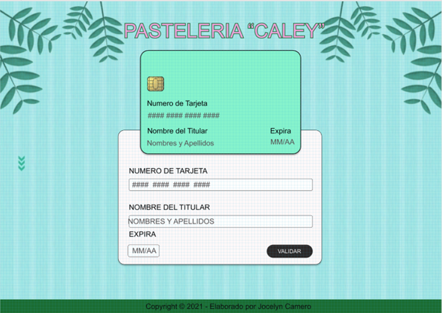
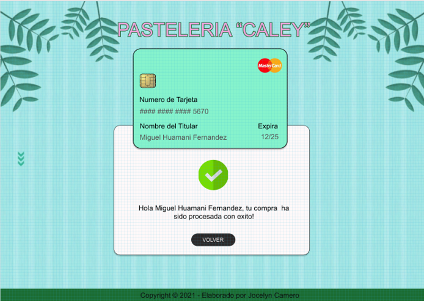
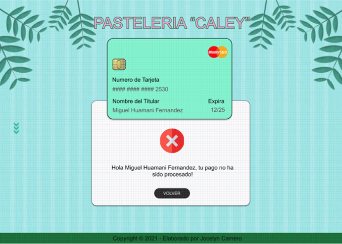

> Este es el prototipo realizado en Figma.
